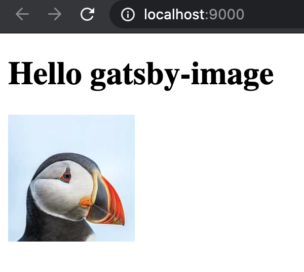

# gatsby-image-build-error

I've encountered a weird error where gatsby is not building images in production. This behaviour is based on the local state of `.cache` & `public` folders - if one of them is missing, then the resulting build contains no images.

## Error

The error can be seen when:

```bash
npm i # install dependencies, etc.
gatsby develop # run the gatsby in development mode - so we have .cache & public folders
rm -rf ./public && gatsby build # remove one of cache folders, and run gatsby build
gatsby serve # go to localhost:9000 - image is not loaded
# image url like "http://localhost:9000/static/da9be9d13642e6487c6e7c7f3bcd1522/034c8/test.jpg" returns 404 with HTML content inside
```

Folder `public/static/` contains one empty directory (but it should contain optimized image).

Resulting site:


## Correct behaviour

The error is not observed when:

```bash
npm i # install dependencies, etc.
gatsby develop # run the gatsby in development mode - so we have .cache & public folders
rm -rf ./public ./.cache && gatsby build # remove both of gatsby working dirs
gatsby serve # go to localhost:9000 - image is loaded
```

The output of the `gatsby build` command contains `success Generating image thumbnails` line, while the error example does not. Folder `public/static/` contains optimized image.

Resulting site:



## Env

MacOSX Catalina (10.15.7)

Node v15.0.1

Gatsby dependencies as seen in `package.json`
